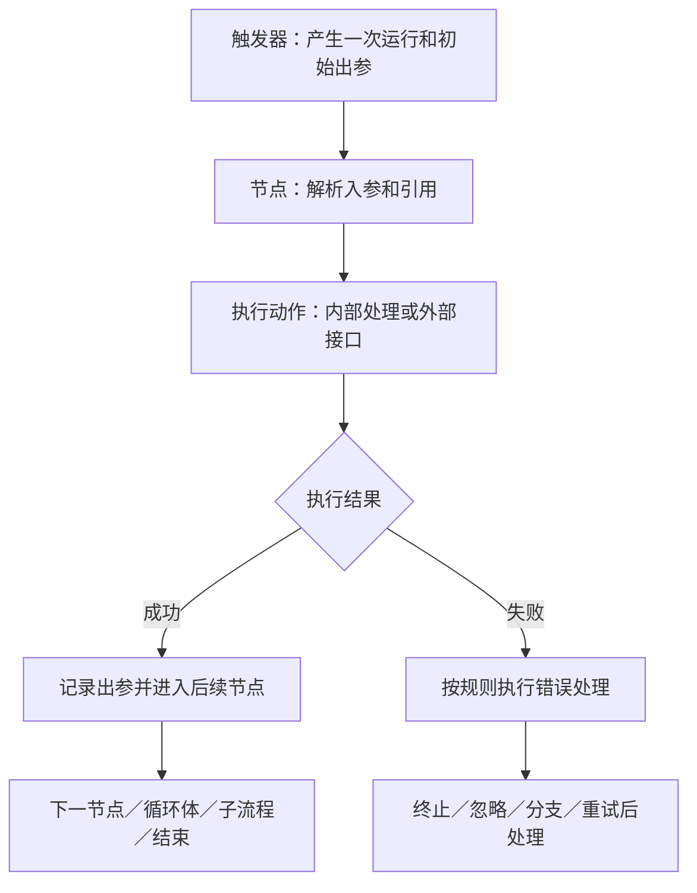

# 飞书集成平台 AnyCross 操作白皮书

资料快照日期：2026-09-21。适用对象：飞书集成平台业务集成工作流、内置组件、飞书与第三方连接器。当前版是**只读研究版**，不是生产运行认证。

本白皮书及其链接的本地手册共同组成操作依据。入口为 [总索引](INDEX.md)，全部事件与动作可查 [操作索引](OPERATIONS.md)，每个组件都有独立手册。公开来源目录保存在 `sources/`，原始网页镜像不随此版本发布；“官方说明”“界面观察”“建议”“待验证”不能互相替代。

## 1. 研究边界与使用方式

本次在指定的练习项目中保持平台只读：阅读公开文档、查看专属项目首页、打开官方模板预览、查看预览节点参数。没有创建、修改、调试、发布、停用或删除工作流，没有操作其他项目的业务工作流。

本地文档覆盖公开目录六类、124 个组件条目。这是目录统计，不等于全部组件历史版本数量，也不等于首页宣传的“130+ 应用连接器”。租户自建连接器、未公开组件和未来变更不在此目录统计中。

后续使用顺序：

1. 根据业务目标，从 [任务索引](INDEX.md) 选择触发器、数据处理和业务动作。
2. 打开相关组件手册，确认操作名称、角色、版本、凭证、输入输出和限制。
3. 按 [Computer Use 手册](guides/COMPUTER_USE.md) 定位项目、节点和参数。
4. 遇到不一致，先查 [证据缺口与勘误](guides/EVIDENCE_GAPS.md)。没有证据的行为不能靠坐标、节点名称或常见编程语言习惯猜测。
5. 有效授权范围内实施时，以一次最小、有代表性的运行验证实际行为；把结果补入本项目后，再将其视为该行为的实操依据。

文档的“唯一依据”含义是统一查阅入口与事实记录，不能让静态文件凌驾于当前可见界面，也不能让尚未验证的步骤自动变成已验证。当前没有足够证据宣称平台已经停止维护。官方存在版本机制、更新记录和修订版自动更新机制，应以实际版本为准。

## 2. 平台对象与运行模型

| 对象 | 作用 | 容易混淆的边界 |
|---|---|---|
| 项目 | 管理工作流、项目配置、数据存储及成员权限 | 本次只允许在指定练习项目 范围内研究；可见不代表可修改 |
| 工作流 | 由触发器启动的一组节点及其执行关系 | 编辑稿、已发布配置、某一次运行不是同一个对象 |
| 触发器 | 为工作流提供启动条件和初始数据 | 触发器可能来自专用触发组件，也可能来自业务连接器事件 |
| 连接器 | 封装某类能力或某个业务系统 | 一个连接器可以同时含事件和普通动作 |
| 操作 | 节点实际执行的具体能力 | 选择连接器后还必须选择正确操作，不能只看图标 |
| 节点 | 工作流中的一个连接器／触发器实例 | 展示名称可与标识符不同；引用必须对应实际节点 |
| 应用凭证 | 平台与业务系统之间的认证关系 | 配置成功不代表获得所有接口权限和数据范围 |
| 胶囊 | 表达式编辑器中的结构化数据引用 | 不是普通字符串，不能把胶囊截图文字当值粘贴 |
| 运行变量 | 一次运行内保存、读取和修改的数据 | 流程结束销毁；旧节点出参只是当时的快照 |
| 项目配置 | 可复用的配置项及多套配置值 | 应确认本次运行／发布选择的是哪套值 |
| 数据集合 | 同一项目内跨运行保存的键值数据 | 写入会影响后续运行；不是临时变量 |
| 运行记录 | 一次运行的节点输入、输出、状态与时间 | 节点显示成功不一定意味着业务目的已经达成 |

一个普通动作常对应一次外部 API 请求，但这不能推广成“所有组件都是可导出的请求代码”。循环、分支、变量、脚本和存储有各自的运行语义。自建连接器文档明确描述了表单字段到 Path、Query、Header、Body 的映射；平台内置连接器的底层实现并未全部公开。



图示是依据官方文档整理的逻辑模型，不表示平台内部调度器实现。

## 3. 画布、节点样式与两种连接

官方编辑器说明将界面划分为三个区域：左侧功能区，中间画布，右侧节点配置。左侧包含连接器、日志、校验、项目配置、数据存储、搜索等入口；不同页面或模板预览的文字可能显示“报错”“配置”。

实际只读模板预览中，画布为浅色点阵背景；节点以圆角图标块表示，右侧展示业务名称和较小的实例标识符；顺序路径用带箭头的细线表示。选中节点出现强调色轮廓和右侧面板。版本按钮在预览中禁用。图标和颜色用于辅助识别，**组件名称、操作名称和字段结构才是操作定位依据**。

### 3.1 流程连接

流程连线回答“先执行谁、走哪条路径”。普通动作可以串联；分支决定执行路径；循环有循环体；子流程是另一个工作流的调用关系。布局上的左右和上下不能替代配置中的执行语义。

### 3.2 数据引用

数据引用回答“这个入参从哪里取值”。官方支持两条入口：

- 从入参的引用入口拖出 snake 连线，指向已有节点，在其出参中选择字段。
- 在表达式编辑器输入 `$`，唤起胶囊选择器，选择节点出参、变量或项目配置，再取更深层字段。

引用某个节点不会自动将它接入正确的执行路径。接好了流程线，也不代表已经配置了数据映射。操作后应分别确认画布结构与入参胶囊。

### 3.3 节点面板

预览中观察到的常见标签包括“操作、凭证、入参、出参、错误处理”；并非每个组件都有全部标签。逻辑节点可能没有凭证、版本按钮或错误处理标签。表单可能包含字符串、数字、布尔值、对象、数组、下拉、文件、代码编辑器及动态字段。

配置表单要同时记录：字段名称、选择的数据类型、是否必填、默认状态、是否通过胶囊引用。`未输入`、空字符串、`null`、`false` 和 `0` 是不同状态。操作切换、版本切换及凭证变化可能改变表单；切换后应重新核对相关字段。

本次没有实际拖拽、重排、插入或删除节点。详细步骤来自官方说明，并在 [Computer Use 手册](guides/COMPUTER_USE.md) 标注证据级别。

## 4. 组件分类与选用

| 分类 | 条目数 | 主要问题 | 查阅入口 |
|---|---:|---|---|
| 逻辑组件 | 8 | 路由、循环、等待、终止、同步返回、子流程 | [逻辑组件](INDEX.md#logic) |
| 助手组件 | 18 | 文本、日期、列表、对象、文件、HTTP、脚本、变量与存储 | [助手组件](INDEX.md#helpers) |
| 触发器 | 8 | 手动、定时、Webhook、子流程及监控事件 | [触发器](INDEX.md#triggers) |
| AI | 9 | 各模型服务调用、生成任务与结果读取 | [AI](INDEX.md#ai) |
| 飞书连接器 | 18 | 消息、群组、通讯录、文档、表格、审批等 | [飞书连接器](INDEX.md#feishu) |
| 业务连接器 | 63 | ERP、CRM、数据库、研发、营销、人事等 | [业务连接器](INDEX.md#business) |

选用顺序建议：现有专用操作能够完成目标时先使用它；简单字段处理用表达式；多步转换可用助手；外部系统有 API 但没有对应专用操作时再考虑 HTTP Client；确需自定义同步计算时用动态脚本；跨工作流复用的业务逻辑用子流程。是否开发自建连接器由真实复用需求决定，不为未来假设预先搭框架。

### 4.1 触发器不是只有“触发器”分类里的八个组件

飞书消息、通讯录、日历、审批以及部分第三方连接器也提供事件。官方组件页有时分为“触发器参数”和“操作参数”两个标签。目录已分别记录两者；例如飞书消息公开版本 2.18 中记录了 13 个事件和 46 个动作。

事件工作流除选择事件外，还可能需要业务侧事件订阅、应用权限、可用范围及平台凭证。只阅读订阅指南不会自动完成这些设置，本次没有修改订阅。

### 4.2 基础逻辑组合

| 组件／操作 | 运行规则 | 配置重点 |
|---|---|---|
| 分支 | 从左到右判断，执行第一条命中分支；未命中走默认分支 | 分支顺序、左右值类型、And／Or；每组件最多 20 分支，每分支最多 10 条件 |
| 广播 | 所有命中分支都需要执行；没有默认分支 | 官方对并行／依次执行表述冲突，不能据此设计有先后依赖的写操作 |
| 串行循环 | 逐个处理列表元素 | 循环体引用 `item`，索引 `index` 从 0 开始；受总执行节点上限约束 |
| 并行循环 | 不保证按列表索引顺序完成 | 官方限定列表最多 1,000 项，超出只处理前 1,000 项；`maxSize` 最大 10 |
| While 循环 | 条件为真进入，串行执行，达到最大次数也退出 | 最大循环次数 1,000；条件读取 `variable.hasMore` 等实时变量 |
| 延迟 | 暂停后继续 | 文档写最长 3 秒，不能当长时任务调度器 |
| 终止 | 结束整个工作流 | 日志表现为运行中止；不能当作只跳过一个循环项 |
| 同步网址触发回调 | 返回同步等待请求的结果，之后节点仍可继续 | 响应内容上限 256 KB；回调不等于整条流程结束 |
| 调用子流程 | 同步调用等待结果；异步调用不返回结果 | 参数契约、版本、最大三层嵌套以及主流程总节点数 |
| 子流程响应 | 为同步调用返回结果 | 配合子流程触发器及调用方式使用 |

### 4.3 数据处理助手

| 助手 | 主要能力与适用边界 |
|---|---|
| 时间和日期助手 | 格式化、当前时间、时间戳及日期计算；记录时区和秒／毫秒单位 |
| 消息卡片助手 | 根据卡片模板与变量生成消息卡片 JSON；还需飞书消息节点发送；卡片权限与卡片发布版本独立于连接器版本 |
| 加解密助手 | Hash、Hmac、加解密、签名验签、JWT、编码解码；算法、密钥、填充、密文编码必须成套对应 |
| 字符串助手 | 分割、包含／匹配、替换、大小写、长度及其它文本操作；按位置截取留意左闭右开边界 |
| 列表助手 | 切割、排序、去重、筛选、聚合、拼接、交补集及属性抽取；元素类型决定可用操作 |
| Object 助手 | 对象属性、键值查询与修改、对象组合等；不要把对象当 JSON 字符串使用 |
| JSON 助手 | Parse 与 Stringify；在结构化对象和 JSON 文本之间转换 |
| 文件助手 | URL 转平台文件、内容／Base64 转文件、命名与压缩等；平台文件描述符不同于普通 URL |
| 邮件助手 | 通过邮箱凭证发送邮件；收件人、抄送、附件与发送身份需明确 |
| XML助手 | XML 与 JSON 转换、XML 文件处理；按对应操作的输入格式配置 |
| CSV助手 | 解析 CSV、分页读取、指定行读取；解析标识仅当次工作流内有效，不能传给子流程使用 |
| 随机数助手 | UUID、随机数字、字符串、Hex、列表元素和对象键值对 |
| 逻辑助手 | 异或与同或等逻辑封装；保持左右值的实际类型 |
| HTTP Client | GET、POST、PUT、PATCH、DELETE、文件传输、内网代理；配置请求体、解析器、编码及成功码 |
| 动态脚本 | 同步 JavaScript 计算；无 HTTP／RPC 等 IO，执行限时 1 秒 |
| 设置变量 | 一次运行内的变量与列表／对象变更；读取最新值用 `variable.名称` 或查询变量值 |
| 数据存储 | 同项目跨运行的持久键值集合；保留分页游标、容量和隔离边界 |
| 数据转换 | 字符串、数值、布尔、列表、对象等转换；不要依赖隐式转换 |

每个助手的操作名称、字段类型摘要与官方入口见其独立手册；完整参数契约和示例以链接的官方资料为准。

## 5. 数据从哪里来，在哪里保存

### 5.1 一次运行内的数据

触发器出参进入后续节点；每个动作消费自己的入参并产生出参。循环体内使用当前循环项，不能默认从循环总节点日志看到每个项的内容。输出选择器可能只显示通用结构，动态业务字段需根据真实出参或官方接口结构继续取值。

例如，多维表格记录列表中的字段路径可能是：

```text
〈实际节点胶囊〉.data.items[0].fields["文档标题"][0].text
```

这里的尖括号部分是说明性占位，不能作为表达式原样粘贴。路径取决于**该操作的真实返回结构**，不是所有多维表格操作都使用同一结构。读取第 0 项前，应明确列表非空；可选字段的空值需按业务含义处理。

### 5.2 最新变量与旧出参

设置变量节点的输出是执行当时的值。后续更新同名变量后，再引用先前节点的输出不会自动变成最新状态。分页循环尤其容易因此反复读取第一页或无法结束。

```text
variable.hasMore
variable.pageToken
```

变量名只允许数字、字母、下划线且不能以数字开头，最长 50 字符；设置变量的变量组最多 30 组。对象、数组在并行场景下需要关注对应并行设置和容量，不能假定无序写入自然产生有序结果。

### 5.3 跨运行状态

项目配置用于管理可复用参数及多套值；数据存储用于保存运行后仍需使用的状态，如业务标识映射、增量同步游标。它们不应与一次运行变量混淆。

持久游标的建议顺序：读取上次成功位置 → 获取本批数据 → 完成本批业务写入 → 保存已完成位置。不要在业务写入成功之前先推进持久游标。若一次写入失败，不应无依据重发整批；先看返回结果和目标系统状态。

本建议是流程设计原则，不表示平台自动提供数据库事务、原子比较更新或“恰好一次”投递。相关能力没有在本次资料中得到保证。

## 6. HTTP、文件与业务系统连接

### 6.1 HTTP 的配置顺序

1. 选择与接口文档一致的请求方法。
2. 配置 URL、路径参数、查询参数及 Header。官方说明 URL 中查询参数会被编码；避免重复手动编码。
3. 按实际接口选择 Raw JSON、Raw Text、form-urlencoded、form-data 或 binary。
4. 配置响应解析器：`json` 得到结构化结果，`none` 得到文本；不要对已经解析的对象再次 JSON Parse。
5. 配置响应编码。文档列出 UTF8、GB2312、GBK、GB18030、None，不能只看“支持四种”的旧措辞。
6. 明确成功状态码及区间。HTTP 2xx 表示 HTTP 层成功，业务失败可能放在 `body.code` 等字段中。
7. 需要访问内网时，使用已部署且对应目标网络的代理凭证；本次没有部署代理或修改网络。

HTTP Client 公开操作页的最新版本为 2.2。GET／POST 支持将响应文件转换为平台文件类型。上传字段文档标注文件上限 40 MB，但文件内容与普通节点入出参 4M 限制不是同一种计量对象；不能据此推断所有操作都支持 40 MB 文本。

### 6.2 文件与格式转换

URL、Base64 字符串、文件字节、平台文件描述符、CSV 解析结果 ID 都是不同对象。用文件助手将 URL／内容转换成平台文件后，再传入要求文件类型的操作。CSV 的 `csvFileId` 仅能在同一工作流当次运行中使用，子流程也不例外。

CSV 默认按 UTF-8 解析，中文文件可能需要 GBK、GB2312 或 GB18030。注释行和空行会跳过，解析后行号不必等于原文件的物理行号。分页读取应根据 `hasMore` 和 `pageToken`，不能简单凭返回条数判断结束。

### 6.3 飞书连接器

飞书连接器通常通过企业自建应用或用户授权访问 API。凭证、应用权限、应用可用范围、目标资源成员关系和事件订阅分别影响结果。需要以某个用户身份执行的接口，不能随意替换成应用身份。

多维表格需区分 Base、数据表、字段、记录及视图 ID。字段值结构由字段类型决定：人员、链接、附件、多选、日期与纯文本不同。消息需同时确认接收者 ID 和 ID 类型；卡片 JSON 应使用对应消息操作。群组管理已拆成独立连接器，旧文章仍有在“飞书消息”中创建群的说明，应以当前组件目录和实际版本为准。

### 6.4 数据库与第三方连接器

MySQL、Microsoft SQL Server、Oracle Database、PostgreSQL 的操作和 SQL 方言不同。先确定公网或本地代理连接方式，再查对应组件手册。普通查询、写入 SQL 与存储过程的语义应依据数据库接口，不根据“查询”字样假定不会修改数据。

ERP／CRM 等连接器的一些操作提供完整业务字段，一些只暴露通用 API 或通用对象入口。字段选择还可能依赖凭证、租户及动态下拉。公开目录不能证明当前业务账号能访问全部操作。

AI 连接器需要分别确认模型服务、模型或推理接入点、凭证、同步／异步接口和额度规则。创建生成任务不等于生成结果已可读取；若操作有“查询任务／获取结果”，应按其真实返回状态衔接。

## 7. 调试、发布和错误处理

官方调试功能会真正运行流程。Mock 触发器出参只是替换起始数据，不代表下游 API 变成模拟调用。本次没有执行调试。

调试前先看校验面板，处理必填和使用限制。一次小规模运行后，从日志检查节点 Input、Output、开始结束时间、耗时和错误码，并确认实际业务结果。手动触发器仅用于调试，不能作为正式发布的触发器。

错误规则按从上到下首次命中执行，未命中使用默认策略。可选终止、忽略、添加分支，以及重试后再执行上述策略。忽略失败后工作流能继续，原节点仍显示失败。错误处理的一键应用作用于相同连接器的相同操作，应注意影响范围。

重试需要区分失败发生在哪里：请求尚未到达、业务明确拒绝、响应丢失、实际已成功但返回超时。这些情况不能用同一重发方式处理。对于创建记录、发消息、提交单据等有副作用的动作，使用接口支持的幂等标识，或者在再次执行前查询结果；本文不假定平台会自动去重。

同步 Webhook 的调用方超时后，工作流仍可能继续执行。同步回调之后也可以继续有节点。因此，“客户端没收到结果”和“流程没做事”不是同一个判断。

编辑完成不等于发布；发布通过不等于后续真实数据都能运行成功。正式发布、修改生产流程和对外发送依然受当时有效授权范围约束，不能由本手册中的示例提供授权。

## 8. 版本、容量与历史差异

连接器显示两位版本号；第三位是平台自动生成的发布编号。前两位任意增加构成新版本，需要工作流手动切换；前两位不变构成修订版，可能无感更新。删除操作不能作为修订版发布。因此，工作流没有编辑过也不代表底层组件完全冻结。

详细差异与限制见 [版本与限制](guides/VERSIONS_AND_LIMITS.md)。已确认的代表性差异：

- 动态脚本 ≤1.2 的旧输入格式与之后版本不同；≤1.5 与 ≥2.0 的同级函数执行规则不同；≥2.0 不再支持 `RegExp.$1` 等非标准写法。
- 同步回调的 `flow_key` 在早期需手填、1.2 可见可编辑且有默认、1.3 及以后自动填充且不可见。
- 飞书消息／飞书群组已有拆分，旧教程中的归属未全部更新。
- 模板中消息卡片助手版本 1.2、飞书消息版本 2.12，是模板实例观察；不等于文档最新版本。

容量与超时必须按对象区分：画布节点数、一次运行执行节点数、嵌套深度、循环次数、平台总体节点超时、HTTP 响应等待和脚本执行限时不是同一限制。

## 9. 代码与导出的正确用途

表达式不是 JavaScript。动态脚本的 `function handler(input)` 与 Workflow Skill 的代码节点入口也不同。自建连接器 API 映射中的 `{{input.xxx}}` 又是另一套模板语法。完整示例、边界与原始来源见 [表达式规范](guides/EXPRESSIONS.md) 和 [代码与导出](guides/CODE_AND_EXPORT.md)。

目前官方资料确认了工作流导入、创建副本、生成模板、跨页面复制粘贴等能力，但本次没有取得实际工作流导出文件。不能编造 JSON 字段结构，也不能声称已经读过内置组件源码。后续如在专属项目取得真实导出，应记录节点 ID、连接关系、操作、版本、字段绑定和资源依赖，再与画布逐项对应。

## 10. 交付结构与证据状态

| 文件 | 用途 |
|---|---|
| [README](README.md) | 阅读入口、覆盖范围和状态 |
| [INDEX](INDEX.md) | 分类、任务和组件定位 |
| [OPERATIONS](OPERATIONS.md) | 事件与操作的全量名称检索 |
| [逐组件手册](manuals/README.md) | 能力、操作清单、字段资料、版本、来源与验证状态 |
| [Computer Use](guides/COMPUTER_USE.md) | 界面定位、拖拽、引用和验证步骤 |
| [表达式](guides/EXPRESSIONS.md) | 类型、胶囊、函数与示例 |
| [代码与导出](guides/CODE_AND_EXPORT.md) | 不同代码环境、示例、结构审阅方法 |
| [流程配方](guides/RECIPES.md) | 基础工作流搭配与失败处理 |
| [版本与限制](guides/VERSIONS_AND_LIMITS.md) | 版本差异、容量与超时 |
| [证据缺口与勘误](guides/EVIDENCE_GAPS.md) | 文档冲突、未公开资料与未实操事项 |
| [覆盖报告](COVERAGE.md) | 自动汇总的实际资料覆盖情况 |

界面与连线说明按连接关系、邻近分组与逐步呈现组织；本项目描述平台已有界面，没有重新设计平台，也没有新增 UI 测试。
