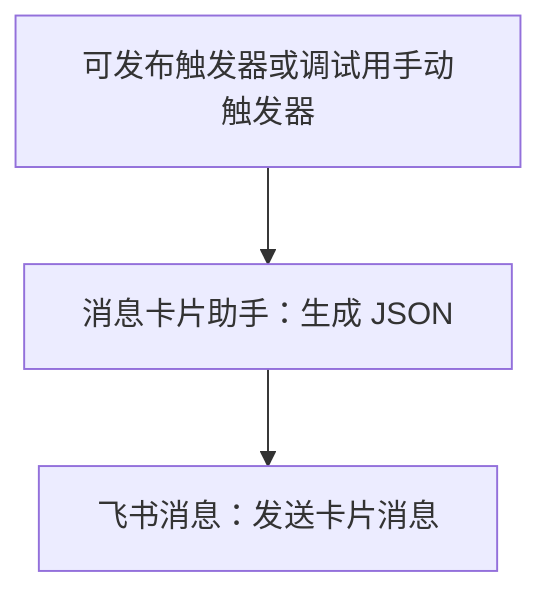
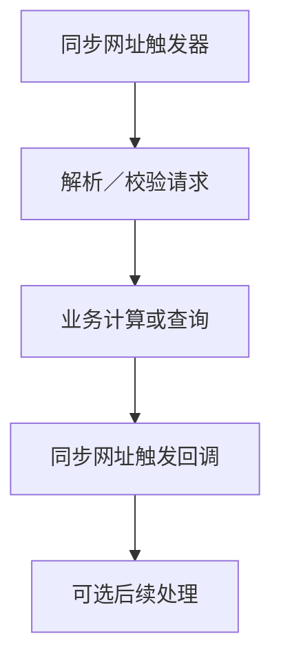
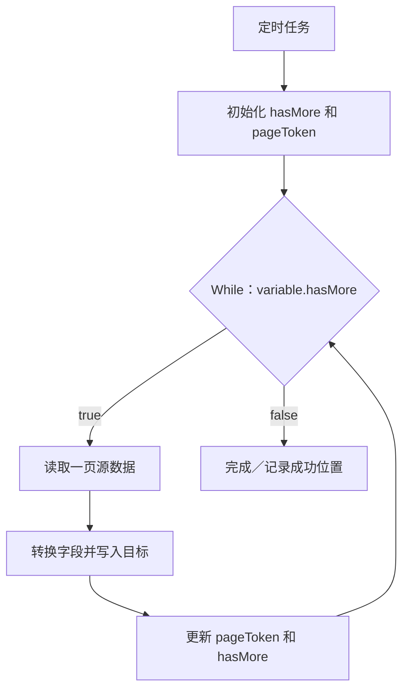

# 常用工作流搭配与操作配方

以下为依据官方能力整理的搭建配方。除明确注明的模板只读观察外，均未在平台实际创建或运行。组件 ID 和字段路径须替换为当前工作流真实值；配方本身不授权对外发送或生产写入。

## 1. 最小数据处理链路

适合在后续获准操作时熟悉节点添加、类型切换、胶囊引用和日志。开始用固定的少量数据，最后检查处理节点输出。手动触发器只供调试，不能直接发布为定时业务流程。

## 2. 组装卡片并发送

配置顺序：确认卡片模板及协作权限 → 选择卡片发布版本 → 填充变量 → 将卡片 JSON 输出映射到消息节点 → 配置凭证、接收者 ID 与 ID 类型 → 检查幂等 Key 的业务含义。

本次 HelloWorld 模板只读预览确认了这条结构，并观察到卡片权限不足提示。卡片助手不会自行发送消息；消息连接器版本和卡片模板发布版本是两个独立版本。

## 3. 同步 Webhook 返回结果

在触发器中配置同步等待时间，在回调中配置状态、内容及 Header。版本 1.3 及以后回调 `flow_key` 自动填充；不要照旧教程重复手填。回调内容不超过 256 KB。

等待超时后后台流程仍可能执行；回调返回后后续节点也可能执行。调用方重发前应有业务去重策略。需要明确区分“已收到请求”“业务已完成”和“后台处理中”的响应语义，不能提前返回业务完成却让关键写入留在回调之后。

## 4. 定时分页同步到多维表格

建议先用串行方式确认字段结构，再根据真实吞吐需求决定是否并行。

| 节点 | 必须配置 | 核对内容 |
|---|---|---|
| 定时任务 | 时区、周期、触发时间、生效期 | 不同周期字段不同；触发频率与一次耗时匹配 |
| 设置变量 | `hasMore=true`；初始游标按接口规则留空或设值 | 未输入与空字符串可能不同 |
| While | `variable.hasMore`；合理最大次数 | 读取最新变量，不引用初始化节点的旧出参 |
| 读取一页 | 过滤条件、分页大小和当前游标 | 找到真实列表字段与下一页标记 |
| 字段转换 | 源字段到目标字段的名称及类型映射 | ID、日期、人员、附件等不能一律当字符串 |
| 写入目标 | 匹配业务键、创建或更新操作 | 防止重复创建；批量失败是否部分成功以接口为准 |
| 更新变量 | 使用本页返回的游标与 hasMore | 本页业务失败时不能盲目推进成功游标 |

数据库没有统一的分页语法，应按 MySQL／SQL Server／Oracle／PostgreSQL 的实际接口和 SQL 方言配置。若源数据会持续变化，排序键和增量边界需由业务定义；不能把偏移分页自然视为可靠增量同步。

## 5. CSV 文件读取与入库

文件 URL → 文件助手转换为平台文件 → CSV 解析 → 保存本次 `csvFileId` → While 分页读取 → 映射表头与字段 → 目标写入 → 更新游标。

CSV 解析标识不能跨工作流、跨项目或传入子流程使用。需要子流程处理时，应传当前页普通数据，而不是解析标识。读取前确认编码、分隔符、注释行和表头处理。分页默认大小为 100；用 `hasMore/pageToken` 继续读取。

## 6. 根据业务状态路由

触发事件 → 读取详情 → 分支判断状态 → 分别执行通过、拒绝或未知状态处理。

只有一个路径应该执行时选择互斥分支；多个独立条件都需要产生结果时选择广播。互斥分支把更具体的条件放在可能覆盖它的宽条件之前。默认分支用于未命中的情况，不等于接口失败处理；接口失败应由错误处理规则处理。

广播的实际并行／顺序语义存在官方文档冲突，因此不能用广播构造“先写 A，保证成功后写 B”这种依赖链。该依赖应放在同一路径中串联。

## 7. 子流程复用

主流程准备输入 → 调用子流程 → 子流程触发器接收入参 → 公共处理 → 子流程响应 → 主流程消费结果。

同步调用适合依赖返回结果的逻辑；异步调用适合不等待结果的独立处理。最大三层嵌套；子流程执行节点计入主流程一次运行节点总量。主／子流程的入参契约应明确必填、类型、默认值、结果和失败表现。

跨工作流依赖的配置、凭证、数据集合及文件有效期不能靠复制流程自动解决。CSV 解析标识有明确禁止跨子流程限制。

## 8. 告警通知

Prometheus／Grafana／Jenkins／告警触发器 → 提取事件字段 → 分支过滤 → 卡片格式化 → 飞书消息。

先确认所选组件是事件接收入口还是普通动作。检查来源系统回调配置、事件重复、告警恢复通知和接收对象；官方资料中的设置按钮是说明，当前只读阶段没有配置任何真实回调或发送通知。

## 9. 接口失败的处理配方

查询接口可以按错误性质选择有限重试；认证失败应处理凭证或权限；参数错误应修正映射；写接口超时应先核对目标状态。失败分支应保留足够的业务键和错误描述供排查，但不在日志或消息中复制密钥。

流程如果忽略了非关键失败，最终结果应能区分“全部完成”和“部分完成”。平台允许继续运行，不代表业务可以无条件把它标为成功。

## 10. AI 工作流

触发器提供文本／文件 → 标准化输入 → 选择对应模型服务操作 → 解析响应 → 业务规则判断 → 后续处理。

如选择的是创建生成任务，需按操作目录继续查询任务状态和结果；不能直接把任务 ID 当成最终内容。结构化输出需检查字段和类型，不直接将模型生成文本当作可执行 SQL、脚本或下一步指令。

模型名称、推理接入点、凭证、额度及异步能力按各组件手册和当前界面配置。AI 分类只有部分模型连接器；飞书 Aily、飞书 AI 及业务分类中的 Moonshot 也与 AI 有关，任务索引会交叉列出。

## 11. 一次配方完成的判断

画布结构正确只是配置证据；关键节点 Input／Output 正确是运行证据；目标系统实际变化正确才是业务结果证据。后续只对本次目标所需入口做相称验证，保留必要日志或脱敏样例，避免反复全量重跑。
